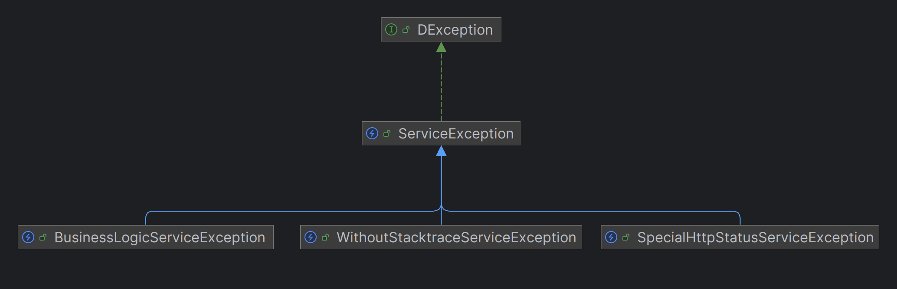

# D-exception

[![Maven Central][maven-central-img]][maven-central-url]
[![Javadocs][javadocs-img]][javadocs-url]

Библиотека предоставляет готовую базовую иерархию классов исключений для вашего приложения. Для Spring-приложений также
предусмотрен абстрактный Exception Resolver класс, который можно расширять.

# Установка MAVEN

Для подключения библиотеки к вашему проекту используйте репозиторий Maven Central.

```xml

<dependency>
    <groupId>ru.dlabs71.library</groupId>
    <artifactId>d-exception</artifactId>
    <version>0.0.1</version>
</dependency>
```

# Использование

## Общая информация

В этом разделе описано базовое использование библиотеки. Для более детального ознакомления см. раздел "Документация" или
JavaDoc.

Библиотека предоставляет базовый интерфейс `DException` и его реализацию — `ServiceException`. Это исключение
предназначено
для использования в качестве базового непроверяемого исключения в приложении. Оно содержит набор фабричных
методов `build`
для создания экземпляров класса. Используйте его вместо `RuntimeException` при создании собственных исключений.

Также в библиотеке представлены классы-наследники ServiceException, каждый из которых имеет свою специфику и назначение:

- `BusinessLogicServiceException` - исключение для ошибок бизнес-логики приложения. Предназначено для информирования
  клиента о невозможности выполнить процесс. Обычно клиент отображает пользователю читаемое сообщение об ошибке. Для
  управления уровнем сообщения используется параметр конструктора `level`. Также добавлен параметр `data` для передачи
  клиенту дополнительной информации об ошибке.
- `WithoutStacktraceServiceException` - исключение, при котором `stacktrace` не отправляется в ответе клиенту. Это
  поведение гарантируется только при использовании `AbstractHttpExceptionResolver`.
- `SpecialHttpStatusServiceException` - исключение с указанным HTTP-статусом ответа. Это поведение также гарантируется
  только при использовании AbstractHttpExceptionResolver.



`AbstractHttpExceptionResolver` - абстрактный класс, предоставляющий базовые методы обработки ошибок (подробнее см.
раздел "Документация"). Для его реализации требуется экземпляр класса, реализующего
интерфейс `DExceptionMessageService`.

`DExceptionMessageService` - интерфейс, который необходимо реализовать для
использования `AbstractHttpExceptionResolver`.
Его задача — предоставить читаемое сообщение по коду ошибки. Пример реализации для Spring приложения:

```java

@Slf4j
public class DefaultExceptionMessageService implements DExceptionMessageService {

    private final ResourceBundleMessageSource messageSource;
    private final Locale locale = Locale.of("ru", "RU");

    public DefaultExceptionMessageService(ResourceBundleMessageSource messageSource) {
        this.messageSource = messageSource;
    }


    @Override
    public String getMessage(String s, Object... objects) {
        try {
            return messageSource.getMessage(s, null, locale);
        } catch (Exception e) {
            log.warn("Get message key='" + s + "' error:" + e.getMessage());
        }
        return s;
    }
}
```

Где ResourceBundleMessageSource может выглядеть следующим образом:

```java
public class Config {

    @Bean
    public ResourceBundleMessageSource messageSource() throws IOException {
        ResourceBundleMessageSource messageSource = new ResourceBundleMessageSource();
        Set<String> baseNames = new HashSet<>();
        baseNames.add("messages");
        Resource[] resources = new PathMatchingResourcePatternResolver()
            .getResources("classpath:*_messages.properties");
        if (resources.length > 0) {
            baseNames.addAll(Arrays.stream(resources)
                                 .map(item -> Objects.requireNonNull(item.getFilename())
                                     .replaceFirst(".properties", ""))
                                 .collect(Collectors.toSet()));
        }

        messageSource.setBasenames(baseNames.toArray(new String[0]));
        messageSource.setDefaultEncoding("UTF-8");
        return messageSource;
    }

}
```

Библиотека предоставляет ряд готовых кодов сообщений в классе `CommonErrorCode`. Соответствующие сообщения для них
находятся в файле [exception_messages.properties](src%2Fmain%2Fresources%2Fexception_messages.properties).

Вы можете создать свои сообщения используя данные коды. Но можно использовать файл с сообщениями который предоставляет
библиотека. Для этого в `pom.xml` файле вашего приложения можно указать следующую конфигурацию

```xml

<project xmlns="http://maven.apache.org/POM/4.0.0" xmlns:xsi="http://www.w3.org/2001/XMLSchema-instance"
         xsi:schemaLocation="http://maven.apache.org/POM/4.0.0 http://maven.apache.org/xsd/maven-4.0.0.xsd">
    <modelVersion>4.0.0</modelVersion>

    ........

    <build>
        <plugins>
            <plugin>
                <groupId>org.apache.maven.plugins</groupId>
                <artifactId>maven-dependency-plugin</artifactId>
                <version>${maven-dependency-plugin.version}</version> <!-- указать актуальную версию -->
                <executions>
                    <execution>
                        <id>copy-resources</id>
                        <phase>process-resources</phase>
                        <goals>
                            <goal>unpack</goal>
                        </goals>
                        <configuration>
                            <artifactItems>
                                <artifactItem>
                                    <groupId>ru.dlabs71.library</groupId>
                                    <artifactId>d-exception</artifactId>
                                    <version>${d-exception.version}</version> <!-- указать актуальную версию -->
                                    <type>jar</type>
                                    <overWrite>true</overWrite>
                                    <outputDirectory>${project.build.outputDirectory}</outputDirectory>
                                    <includes>**/*.properties</includes>
                                </artifactItem>
                            </artifactItems>
                        </configuration>
                    </execution>
                </executions>
            </plugin>
        </plugins>
    </build>
</project>
```

# Документация

## Оглавление

* [1. Классы исключений](#section1)
    * [1.1 DException и ServiceException](#section11)
    * [1.2 BusinessLogicServiceException](#section12)
    * [1.3 WithoutStacktraceServiceException](#section13)
    * [1.4 SpecialHttpStatusServiceException](#section14)
* [2. Exception Resolver](#section2)
* [3. Utility классы, enum-ы](#section3)
* [4. Сборка из исходников](#section4)
* [5. Checkstyle](#section5)

## <h2 id="section1">1. Классы исключений</h2>

Иерархия классов исключений:


### <h3 id="section11">1.1 DException и ServiceException</h3>

`DException` - Базовый интерфейс всех исключений. Используйте его для создания собственных исключений или воспользуйтесь
готовой реализацией `ServiceException`. Данное исключение
предназначено для использования в качестве базового непроверяемого исключения в приложении. Оно содержит набор фабричных
методов `build` для создания экземпляров класса. Используйте его вместо `RuntimeException`.

Исключение содержит два поля, одно из которых должно быть заполнено:

- `message` - текстовое описание ошибки. Если сообщение начинается с символа `$`, то `AbstractHttpExceptionResolver`
  попытается получить сообщение через реализацию интерфейса `DExceptionMessageService` (например: Resource Bundle),
  используя строку после символа `$` в качестве кода.
- `errorCode` - код ошибки. Должен реализовывать интерфейс `ErrorCode`. Обычно это enum (например, предоставляемый
  библиотекой `CommonErrorCode`), который содержит код ошибки и код сообщения из Resource Bundle. Если `message` не
  указан явно, то при создании `ErrorResponseDto` сообщение будет взято из `ErrorCode`. В `ErrorResponseDto`
  предусмотрено отдельное поле для кода ошибки, что позволяет клиенту гибко обрабатывать ошибки.

### <h3 id="section12">1.2 BusinessLogicServiceException</h3>

`BusinessLogicServiceException` - исключение для ошибок бизнес-логики приложения. Предназначено для информирования
клиента о невозможности выполнить процесс. Обычно клиент отображает пользователю читаемое сообщение об ошибке. Для
управления уровнем сообщения используется параметр конструктора `level`. Также добавлен параметр `data` для передачи
клиенту дополнительной информации об ошибке.

Содержит следующие поля:

`level` - предназначен для управления контекстным состоянием оповещения на клиенте (ERROR, WARNING, INFO и т.д.).
`data` - предназначен для передачи клиенту дополнительной информации об ошибке.

### <h3 id="section13">1.3 WithoutStacktraceServiceException</h3>

`WithoutStacktraceServiceException` - исключение, при котором `stacktrace` не отправляется в ответе клиенту. Это
поведение гарантируется при использовании `AbstractHttpExceptionResolver`. Не используйте это исключение повсеместно,
так как для отключения отображения `stacktrace` в ответе существует специальный параметр
в `AbstractHttpExceptionResolver` (см. документацию). Это исключение следует использовать только в случаях, когда
необходимо гарантированно запретить отображение `stacktrace` в`ErrorResponseDto`.

Дополнительных полей класс не содержит.

### <h3 id="section13">1.3 SpecialHttpStatusServiceException</h3>

`SpecialHttpStatusServiceException` - реализация исключения с указанным http status ответа. Это
поведение гарантируется при использовании `AbstractHttpExceptionResolver`.

Содержит следующие поля:

`httpStatus` - HTTP-статус ответа.

## <h2 id="section2">2. Exception Resolver</h2>

Библиотека предоставляет абстрактный класс для создания собственного обработчика исключений.
`AbstractHttpExceptionResolver` позволяет включать или отключать `stacktrace` в ответе, а также предоставляет набор
готовых
методов для создания `ResponseEntity` на основе исключения. В таблице ниже приведено краткое описание этих методов.

Для указания сообщения об ошибке в `ResponseEntity` методы класса используют следующие правила:

Для исключений, реализующих интерфейс `DException`:

- Если в исключении указан `message`, он будет использован для ответа
- Если `message` начинается с символа `$` то для получения сообщения будет использован `DExceptionMessageService`.
  Содержимое `message` будет использовано как код для получения сообщения.
- Если `message` не указан, но указан `ErrorCode`, то на основе соответствующего кода
  сообщения (`ErrorCode.getCodeMessage()`), через `DExceptionMessageService` будет получено исходное сообщение для
  ответа.
- Если `message` и `ErrorCode` не указаны то сообщение будет создано через `DExceptionMessageService`
  используя `CommonErrorCode.COMMON_EXCEPTION.getCodeMessage()`. В качестве аргумента будет передано сообщение из
  базового исключения (если есть). См. `DException.getCauseExceptionMessage()`.

Для более детального разбора алгоритма
смотрите [`ResponseEntityHelper.acquireMessage()`](src%2Fmain%2Fjava%2Fru%2Fdlabs71%2Flibrary%2Fexception%2Futils%2FResponseEntityHelper.java).

Используя `AbstractHttpExceptionResolver`, можно легко создать собственный `ExceptionResolver`. Например, для
Spring-приложений можно использовать следующий класс:

```java
import jakarta.servlet.http.HttpServletRequest;
import java.io.FileNotFoundException;
import java.io.IOException;
import org.springframework.http.ResponseEntity;
import org.springframework.web.bind.annotation.ExceptionHandler;
import org.springframework.web.bind.annotation.RestControllerAdvice;
import ru.dlabs71.library.exception.DExceptionMessageService;
import ru.dlabs71.library.exception.dto.ErrorResponseDto;
import ru.dlabs71.library.exception.exception.BusinessLogicServiceException;
import ru.dlabs71.library.exception.exception.ServiceException;
import ru.dlabs71.library.exception.exception.SpecialHttpStatusServiceException;
import ru.dlabs71.library.exception.exception.WithoutStacktraceServiceException;

/**
 * It's simple exception resolver who extends the {@linkplain AbstractHttpExceptionResolver} class.
 * <p>
 * <div><strong>Project name:</strong> d-exception </div>
 * <div><strong>Creation date:</strong> 2024-08-24 </div>
 * </p>
 *
 * @author Ivanov Danila
 * @since 1.0.0
 */
@RestControllerAdvice
public final class SimpleHttpExceptionResolver extends AbstractHttpExceptionResolver {

    public SimpleHttpExceptionResolver(boolean enableStacktrace, DExceptionMessageService messageService) {
        super(enableStacktrace, messageService);
    }

    @Override
    @ExceptionHandler({ BusinessLogicServiceException.class })
    public ResponseEntity<ErrorResponseDto> resolveBusinessLogicException(
        HttpServletRequest request,
        BusinessLogicServiceException exception
    ) {
        return super.resolveBusinessLogicException(request, exception);
    }

    @Override
    @ExceptionHandler({ ServiceException.class })
    public ResponseEntity<ErrorResponseDto> resolveServiceException(
        HttpServletRequest request,
        ServiceException exception
    ) {
        return super.resolveServiceException(request, exception);
    }

    @Override
    @ExceptionHandler({ WithoutStacktraceServiceException.class })
    public ResponseEntity<ErrorResponseDto> resolveServiceException(
        HttpServletRequest request,
        WithoutStacktraceServiceException exception
    ) {
        return super.resolveServiceException(request, exception);
    }

    @Override
    @ExceptionHandler({ SpecialHttpStatusServiceException.class })
    public ResponseEntity<ErrorResponseDto> resolveServiceException(
        HttpServletRequest request,
        SpecialHttpStatusServiceException exception
    ) {
        return super.resolveServiceException(request, exception);
    }

    @ExceptionHandler({ FileNotFoundException.class })
    public ResponseEntity<ErrorResponseDto> resolveFileNotFoundException(
        HttpServletRequest request,
        Exception exception
    ) {
        return super.resolveFileNotFoundException(request, exception);
    }

    @Override
    @ExceptionHandler({ IOException.class })
    public ResponseEntity<ErrorResponseDto> resolveIOException(
        HttpServletRequest request,
        IOException exception
    ) {
        return super.resolveIOException(request, exception);
    }

    @Override
    @ExceptionHandler({ AssertionError.class })
    public ResponseEntity<ErrorResponseDto> resolveAssertationError(
        HttpServletRequest request,
        AssertionError error
    ) {
        return super.resolveAssertationError(request, error);
    }

    @Override
    @ExceptionHandler({ Throwable.class })
    public ResponseEntity<ErrorResponseDto> resolveDefaultException(HttpServletRequest request, Throwable exception) {
        return super.resolveDefaultException(request, exception);
    }
}

```

## <h2 id="section3">3. Utility классы, enum-ы</h2>

Библиотека предоставляет готовые реализации интерфейсов `ErrorCode` и `ErrorLevel`.

`CommonErrorCode` - готовая реализация интерфейса `ErrorCode`. Enum, содержащий набор кодов и сообщений для часто
встречающихся исключений в веб-приложениях. Сообщения представлены в виде кодов для получения через ResourceBundle
локализованного сообщения. Готовые сообщения содержатся в
файле [exception_messages.properties](src%2Fmain%2Fresources%2Fexception_messages.properties).

`CommonErrorLevel` - готовая реализация интерфейса `ErrorLevel`. Enum, содержащий распространённые уровни оповещений.

`ResponseEntityHelper` - вспомогательный класс для создания ответа на основе исключения.

`DExceptionMessageService` - интерфейс для получения сообщения по коду (например через ResourceBundle).

Используемые коды сообщений перечислены в таблице ниже:

| Код                          | Сообщение                                                                                                               |
|------------------------------|-------------------------------------------------------------------------------------------------------------------------|
| common.exception             | Ошибка выполнения операции: {0}                                                                                         |
| stale.object.exception       | Объект был изменен другим пользователем. Для продолжения работы необходимо обновить текущую страницу                    |
| lock.object.exception        | Объект изменяется другим пользователем. Попробуйте повторить действие позднее после обновления текущей страницы         |
| entity.not.found.exception   | Текущий объект не найден, возможно, он был удален другим пользователем или недоступен по политике доступа               |
| error.module.not.available   | Серверный модуль {0} временно недоступен. Попробуйте повторить действие позднее или обратитесь к администратору сервиса |
| access.denied.exception      | Доступ запрещён                                                                                                         |
| security.exception           | Ошибка механизмов безопасности                                                                                          |
| invalid.request.exception    | Неправильно составленный запрос. Проверьте параметры и путь запроса                                                     |
| validation.exception         | Ошибка условий валидации: {0}                                                                                           |
| resource.not.found.exception | Указанный ресурс не найден: {0}                                                                                         |
| file.not.found.exception     | Указанный файл не найден: {0}                                                                                           |
| io.exception                 | Ошибка операций ввода/вывода                                                                                            |

## <h2 id="section4">4. Сборка из исходников</h2>

Для сборки из исходников понадобиться система автосборки Maven 3.9.2 или выше. Используемая версия Java 1.8.
Для сборки с выполнением тестов достаточно выполнить следующую команду из корня проекта:

```shell
mvn clean install
```

Для сборки без выполнения тестов:

```shell
mvn clean install -DskipTests
```

## <h2 id="section5">5. Checkstyle</h2>

В проекте настроен Checkstyle при сборке проекта. Используемая версия checkstyle 9.3. Файлы настроек checkstyle
находятся в директории `checkstyle` в корне проекта. Для проекта был выбран формат Google Checkstyle. Но также были
внесены следующие изменения.

1. Увеличены отступы

```xml

<module name="Indentation">
    <property name="basicOffset" value="4"/>
    <property name="braceAdjustment" value="2"/>
    <property name="caseIndent" value="4"/>
    <property name="throwsIndent" value="4"/>
    <property name="lineWrappingIndentation" value="4"/>
    <property name="arrayInitIndent" value="4"/>
</module>
```

Для детальной информации о настройке maven-checkstyle-plugin смотрите [pom.xml](pom.xml).

Также в директории `checkstyle` добавлена директория `idea`. В ней находиться xml конфигурация Code Style для Intellij
IDEA. Данная конфигурация настроена таким образом, чтобы не противоречить checkstyle.

[maven-central-img]: https://maven-badges.herokuapp.com/maven-central/ru.dlabs71.library/d-exception/badge.svg?gav=true

[maven-central-url]: https://maven-badges.herokuapp.com/maven-central/ru.dlabs71.library/d-exception/?gav=true

[javadocs-img]: https://javadoc.io/badge2/ru.dlabs71.library/d-exception/javadoc.svg

[javadocs-url]: https://javadoc.io/doc/ru.dlabs71.library/d-exception

[license-image]: https://img.shields.io/badge/license-MIT-blue.svg

[license-url]: LICENSE